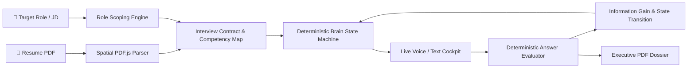

# ✦ InterviewPilot

<div align="center">
  
  <h2>InterviewPilot — Adaptive AI Mock Interview Simulation Engine</h2>
  <p><strong>Practice the interview you’re actually going to face.</strong></p>
  <p>Hyper-calibrated mock interview loops grounded in your resume, target role, and job description with deterministic competency tracking, conversational voice mode, and auditable STAR scoring.</p>

  <p>
    
    
    
    
    
    
    
    
  </p>
</div>

---

## ⚡ Overview

**InterviewPilot** is a production-grade AI mock interview platform that eliminates generic, cookie-cutter practice questions. Built with a deterministic **Interview Brain**, InterviewPilot isolates target role rubrics from raw resume claims to ensure zero AI hallucinations, delivers conversational voice simulations with live telemetry, and calculates mathematical answer scores without hardcoded bias.



---

## 🏛️ Core Architectural Pillars

### 1. 🎯 Role-Scoped Resume Grounding & Archetype Isolation
```
TARGET ROLE + RESUME EVIDENCE
        ↓
ROLE-SCOPED RESUME EVIDENCE
        ↓
INTERVIEW COMPETENCIES
```
- **Archetype Isolation:** Prevents out-of-scope question drift (e.g., uploading a Developer resume for a **"UI/UX Intern"** role yields canonical UI/UX rubrics like *User Research, Wireframing, and Usability Testing*—with **zero backend or coding questions generated**).
- **Anti-Hallucination Guard:** If direct evidence is absent for a target role competency, the opening objective formulates an exploratory behavioral question with `useResumeGrounding: false` to eliminate fabricated claims.

### 2. 🧠 Deterministic Interview Brain & Competency Map Engine
- **Strategy Orchestration:** 100% deterministic TypeScript decision engine (`"What does InterviewPilot need to learn next?"`).
- **Information Gain Scoring:** Prioritizes critical untested competencies over reliable ones.
- **Adaptive Difficulty:** Automatically tunes question depth (`foundational` $\leftrightarrow$ `intermediate` $\leftrightarrow$ `advanced`) based on consecutive evaluation performance.
- **Follow-Up Budgeting:** Enforces strict limits on follow-up probes per competency and exits gracefully with zero filler questions.

### 3. 📊 Deterministic Mathematical Answer Scoring
- **Auditable Dimensional Formula:**
  $$\text{Score} = 0.25 \times \text{Relevance} + 0.20 \times \text{Depth} + 0.20 \times \text{Evidence} + 0.15 \times \text{RoleAlignment} + 0.10 \times \text{Structure} + 0.10 \times \text{Clarity}$$
- **Zero Hallucinated Deductions:** Special gates (irrelevant answers, refusals, clarification requests) are deterministically handled without penalty or score distortion.

### 4. 🎙️ Live Conversational Voice Mode & Speech Telemetry
- **Barge-In & Interruption Detection:** Allows candidates to speak naturally and interrupt prompts.
- **Live Telemetry Engine:** Calculates speaking cadence (Words Per Minute), counts verbal crutches (`um`, `uh`, `like`, `you know`, `basically`), and measures pause durations directly from speech transcripts.
- **Anti-Cheating State Machine:** Monitors tab switching and window focus with warning and termination safeguards.

### 5. 📄 Executive PDF Dossiers & Reports
- **Print-Perfect Engine (`@media print`):** Formats complete STAR critiques, score breakdowns, delivery telemetry, and developmental coaching drills into executive PDF reports.
- **Instant Past Session Replay:** Idempotently loads past sessions from Supabase with timeout-protected fallbacks.

### 6. 🎨 Persona Avatars & Apple Emojis
- **`react-apple-emojis` Integration:** High-resolution Apple emoji avatars across AI, Engineering, Creative, and Leadership personas directly selectable from the profile.

---

## 🛠️ Tech Stack

| Layer | Technologies |
|---|---|
| **Core Framework** | [React 19](https://react.dev/), [TypeScript 5.7](https://www.typescriptlang.org/), [Vite 6](https://vitejs.dev/) |
| **Styling & UI** | [TailwindCSS 3.4](https://tailwindcss.com/), High-Contrast Obsidian Dark / Clean Light Mode |
| **AI Intelligence** | [Google Gemini 2.0 Flash / Pro](https://ai.google.dev/), Deterministic Brain Engine, PDF.js spatial parser |
| **Voice & Audio** | Web Audio API, Web Speech Recognition, Gemini Live WebSockets |
| **Database & Auth** | [Supabase](https://supabase.com/) (PostgreSQL, Row Level Security, Edge Functions, Passwordless Email OTP) |
| **Emoji & Icons** | [react-apple-emojis](https://github.com/dherault/react-apple-emojis), [Lucide React](https://lucide.dev/) |
| **Testing** | Node.js Test Runner, TypeScript execution via `tsx` (257 regression scenarios) |

---

## 🚀 Getting Started

### Prerequisites
- **Node.js**: `v18.0.0` or higher
- **npm**: `v9.0.0` or higher

### Environment Variables
Create a `.env` file in the root directory:

```env
# Supabase Configuration
VITE_SUPABASE_URL=https://your-project.supabase.co
VITE_SUPABASE_ANON_KEY=your-supabase-anon-key

# Optional Client-Side Gemini Fallback API Key
VITE_GEMINI_API_KEY=your-gemini-api-key
```

### Installation & Run

1. **Clone the repository:**
   ```bash
   git clone https://github.com/Charantej111/InterviewPilot.git
   cd InterviewPilot
   ```

2. **Install dependencies:**
   ```bash
   npm install
   ```

3. **Start the local development server:**
   ```bash
   npm run dev
   ```
   Open `http://localhost:5173` in your browser.

4. **Run the Automated Test Suite:**
   ```bash
   npx tsx test/runTests.ts
   ```

5. **Build for production:**
   ```bash
   npm run build
   ```

---

## 📁 Project Structure

```text
InterviewPilot/
├── public/                        # Brand assets, logos, avatar media
├── src/
│   ├── components/
│   │   ├── auth/                  # OTP input, ProtectedRoute guards
│   │   ├── dashboard/             # Readiness metrics, recent sessions ledger
│   │   ├── interview/             # Interview room cockpit, question card, voice visualizer
│   │   ├── landing/               # Hero section, feature grid, pricing
│   │   ├── layout/                # AppShell, Navbar, AppHeader, Footer
│   │   ├── report/                # Dossier charts, drills, coaching modals
│   │   ├── setup/                 # Resume intelligence dropzone, JD calibration
│   │   └── ui/                    # Avatar, Button, Input, AILoader, CustomCursor
│   ├── context/                   # InterviewContext, UserContext, ThemeContext
│   ├── pages/                     # LandingPage, DashboardPage, InterviewRoomPage, FinalReportPage, ProfilePage, SettingsPage
│   ├── services/
│   │   ├── ai/                    # interviewBrain, interviewContract, roleScoping, deterministicAnswerEvaluator, answerScoreEngine
│   │   ├── supabase/              # authService, interviewService, evaluationService, resumeService, profileService
│   │   └── voice/                 # GeminiLiveVoiceProvider, speech recognition
│   └── types/                     # TypeScript database, interview, resume, and telemetry schemas
├── test/                          # 257 automated regression test suites
│   ├── fixtures/                  # Structural resume and JD fixtures
│   ├── roleScopedResumeGrounded.test.ts
│   ├── answerIntelligence.test.ts
│   ├── deterministicScoring.test.ts
│   ├── interviewLifecycle.test.ts
│   └── runTests.ts                # Master test runner
└── vite.config.ts                 # Vite build configuration
```

---

## 🧪 Testing & Verification

InterviewPilot includes a comprehensive regression test suite with **257 automated test scenarios**:

| Test Group | Scenarios | Focus Areas |
|---|---|---|
| **Phase 1 & 2** | 48 tests | 2-Column PDF Spatial Parsing, Section Boundary Extraction, JD Match Analysis |
| **Phase 3** | 34 tests | Interview Contract Bounded Constraints, Time Budgeting, Competency Map Transitions, Information Gain |
| **Phase 4** | 43 tests | Deterministic Answer Intelligence, Relevance Gating, Normalized Weighted Math |
| **Phase 5** | 64 tests | Voice Safety Reducers, Interruption Handling, Lifecycle State Transitions |
| **Role-Scoped Grounding** | 33 tests | Archetype Classification, Domain Isolation, Zero-Hallucination Opening Objectives |
| **Integrity & Security** | 35 tests | Stale Hash Invalidation, Tab-Switch Cheating Detection, Rate-Limited Auth |

Run all tests:
```bash
npx tsx test/runTests.ts
```

---

## 📄 License

This project is licensed under the [MIT License](LICENSE).

---

<div align="center">
  Built with ❤️ by <a href="https://charan.ofzen.in/">Charan Tej Neelam</a> · <a href="https://www.linkedin.com/in/charan-tej-neelam-bb0a9a302">LinkedIn</a>
</div>
